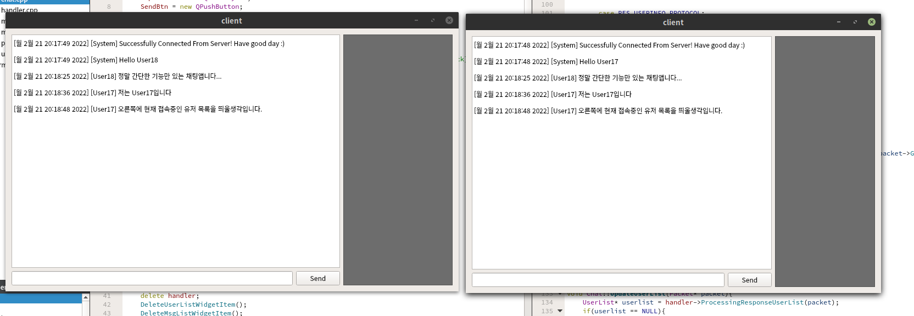

# ChatServer
정말 간단한 채팅앱입니다. 

# Server
서버의 경우 클라이언트의 입력(이벤트)를 대기하는 스레드를 EPOLL로 처리하였으며 클라이언트에대한 각종 이벤트 처리를 위한 실질적인 로직은 스레드를 생성하여 처리합니다. 

### Example 
EPOLL_WAIT중인 하나의 스레드에 클라이언트에 이벤트가 모니터링된다면 해당 스레드는 이벤트를 확인(EPOLLIN)하여 이벤트를 읽는(Read) 스레드가 처리할 수 있도록 Read Queue에 값을 넣고 condition wait중인 스레드를 notify합니다. 
그리고 하나하나씩 해당 큐를 꺼내 읽기처리를 진행합니다. 
클라이언트에 대한 쓰기도 읽기 작업과 동일하게 처리 됩니다.

# Client
클라이언트는 Qt를 이용하여 아주 간단무시하게 만들었습니다. 
사지방에서 되는게 Qt입니다.

# Image

